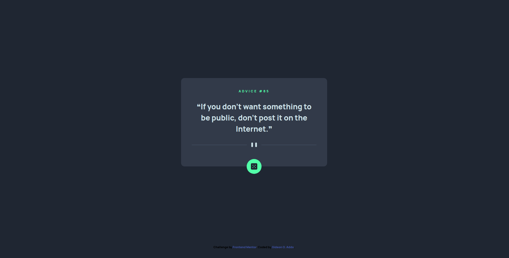

# Frontend Mentor - Advice generator app solution

This is a solution to the [Advice generator app challenge on Frontend Mentor](https://www.frontendmentor.io/challenges/advice-generator-app-QdUG-13db). Frontend Mentor challenges help you improve your coding skills by building realistic projects.

## Table of contents

- [Overview](#overview)
  - [The challenge](#the-challenge)
  - [Screenshot](#screenshot)
  - [Links](#links)
  - [Built with](#built-with)
  - [What I learned](#what-i-learned)
  - [Continued development](#continued-development)
  - [Useful resources](#useful-resources)
- [Author](#author)

## Overview

Advice Generator App

### The challenge

Users should be able to:

- View the optimal layout for the app depending on their device's screen size
- See hover states for all interactive elements on the page
- Generate a new piece of advice by clicking the dice icon

### Screenshot



### Links

- Solution URL: [Solution URL](https://github.com/wuzgood98/Advice-Generator-App)
- Live Site URL: [Live Site URL](https://wuzgood98.github.io/Advice-Generator-App/)

### Built with

- Semantic HTML5 markup
- CSS custom properties
- Flexbox
- JavaScript
- Axios

### What I learned

Improved on my skills on using axios to get data from JSON APIs.

```js
const getAdvice = async () => {
  try {
    const response = await axios.get('https://api...');
    console.log(response);
  } catch (error) {
    console.error(error);
  }
}
```

### Continued development

- Using axios to get data from JSON APIs.


### Useful resources

- [Axios](https://github.com/axios/axios#installing) - This helped me have a more cleaner and simple code. I really liked this pattern and will use it going forward.

## Author

- Frontend Mentor - [@wuzgood98](https://www.frontendmentor.io/profile/wuzgood98)
- Twitter - [@wuz_goood](https://www.twitter.com/wuz_goood)

**Note: Delete this note and add/remove/edit lines above based on what links you'd like to share.**

## Acknowledgments

I give credits to myself for being able to complete this project without asking for help and or looking for answers on the internet.
